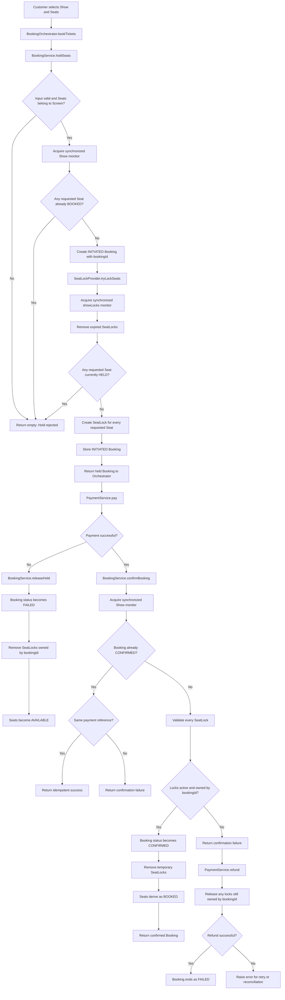

# BookMyShow Quick Revision

## Screen, Show, Seat, and Booking

```text
Theatre
  -> owns Screens

Screen
  -> defines the physical seat layout
  -> owns reusable Seats
  -> hosts scheduled Shows

Show
  -> schedules one Movie on one Screen
  -> contains only movie, screen, and timing information

SeatLock
  -> represents one temporary hold for one Show and Seat
  -> stores booking ID, customer, and expiration time

SeatLockProvider
  -> maps each Show and Seat to its active SeatLock
  -> atomically locks all requested seats or none

Seat
  -> identifies a physical location such as A10
  -> contains stable layout information such as row, column, and tier

Booking
  -> owns booking ID, customer, selected Seats, and booking status

SeatStatus
  -> is derived for display; it is not stored separately
```

## Critical Ownership Rule

> `Screen` owns physical seats; `SeatLockProvider` owns temporary holds; `BookingService` owns bookings.

A physical seat is reused across multiple shows:

```text
Screen 1 owns Seat A10.

3 PM Show:
A10 -> BOOKED

7 PM Show:
A10 -> AVAILABLE
```

Therefore, `SeatStatus` must not be stored inside the physical `Seat`. Otherwise,
booking A10 for the 3 PM show would incorrectly make A10 unavailable for every
other show on that screen.

## Suggested Model

```java
public record Seat(
        String row,
        int column,
        Tier tier
) {
}
```

```java
public class Screen {
    private String name;
    private Set<Seat> seats;
    private Set<Show> shows;
}
```

```java
public class Show {
    private Movie movie;
    private Screen screen;
    private long startTime;
    private long endTime;
}
```

## Availability Derivation

Temporary holds are stored in a sparse nested map:

```text
Map<Show, Map<Seat, SeatLock>>
```

Availability is derived as follows:

```text
Seat belongs to a CONFIRMED Booking -> BOOKED
Seat has an active SeatLock          -> HELD
Otherwise                            -> AVAILABLE
```

`BookingService` iterates through every physical `Screen` seat so the response
contains the complete layout, including seats with no lock or booking entry.

## Seat State Transitions

```text
AVAILABLE
  -> HELD when a customer temporarily reserves the seat

HELD
  -> BOOKED after successful payment
  -> AVAILABLE when payment fails or the hold expires

BOOKED
  -> terminal for the current show unless cancellation is supported
```

## Complete Booking Flow



Important ownership checks during late payment:

```text
B1's hold expires
-> B2 acquires the same Seat
-> payment callback arrives for B1
-> B1 validation sees that the current SeatLock belongs to B2
-> B1 confirmation fails and its payment is refunded
-> B1 cleanup cannot remove B2's lock because booking IDs differ
```

## Source of Truth

- `Screen.seats` is the source of truth for physical capacity and layout.
- `SeatLockProvider.locks` is the source of truth for temporary holds.
- `BookingService.bookings` is the source of truth for initiated and confirmed bookings.
- Capacity is derived from `screen.getSeats().size()`.
- Tier counts are derived by filtering the screen's seats.
- Availability is derived from confirmed bookings and active seat locks.
- Do not store duplicate counters unless a demonstrated performance requirement
  justifies maintaining them consistently.

## Why `synchronized(show)` Is Required

`SeatLockProvider` protects its inner `Map<Seat, SeatLock>` with:

```java
synchronized (showLocks) {
    // Check all requested seats, then lock all or none.
}
```

That protects only the temporary-lock map. A complete booking operation also
uses `BookingService.bookings`, so hold and confirmation must coordinate both
structures.

For example, confirmation changes A1 from a temporary hold to a permanent
booking:

```text
Validate A1's SeatLock
-> change Booking B1 to CONFIRMED
-> remove A1's temporary SeatLock
```

Without `synchronized(show)`, the following check-then-act race is possible:

```text
Initial state:
A1 is HELD by C1 through Booking B1.

C2 checks confirmed bookings:
A1 is not confirmed yet.

C1 confirms B1:
A1 becomes BOOKED and its temporary lock is removed.

C2 calls tryLockSeats using the earlier result:
No temporary lock now exists, so C2 incorrectly locks A1.

Final invalid state:
A1 is BOOKED by C1 and HELD by C2.
```

Using the same Show monitor around hold and confirmation prevents this
interleaving:

```java
synchronized (show) {
    checkConfirmedBookings();
    tryLockAllRequestedSeats();
}
```

```java
synchronized (show) {
    validateAllSeatLocks();
    confirmBooking();
    removeTemporaryLocks();
}
```

The result is deterministic:

```text
If C2 runs first:
C1's active SeatLock blocks C2.

If C1 confirms first:
C2 sees A1 in a CONFIRMED Booking and is rejected.
```

Availability displayed in the UI is only a snapshot. C2 may have loaded the
page before C1 held A1, so `holdSeats()` must always revalidate the current
state on the backend. An up-to-date frontend normally disables HELD or BOOKED
seats, but frontend validation is not a concurrency guarantee: its state may
be stale, two requests may race, or a caller may invoke the API directly.

Synchronization is per Show rather than global:

```text
Operations for the 3 PM Show coordinate with each other.
Operations for the 7 PM Show can proceed concurrently.
```

In summary:

```text
synchronized(showLocks)
-> protects atomic updates inside the temporary-lock map

synchronized(show)
-> protects the complete business transition across bookings and locks
```

## Interview One-Liner

> “A Screen defines reusable physical seats, SeatLockProvider atomically manages temporary holds, and BookingService coordinates the HELD-to-BOOKED transition per Show.”
