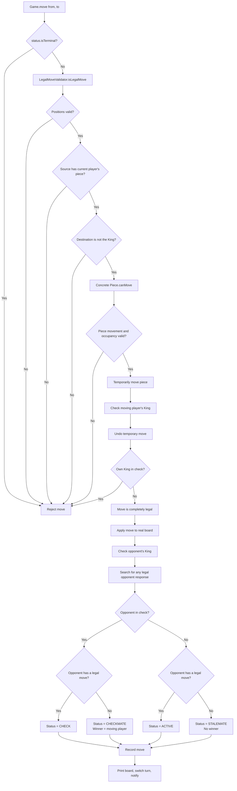

# Chess LLD Quick Revision

## Core design

- `Game` owns match flow: players, current turn, status, winner, move history, validation, capture, and turn switching.
- `Board` owns the location of pieces and provides operations to inspect or update squares.
- `Piece` owns common piece data such as `Color` and defines the polymorphic `canMove(...)` contract.
- Each concrete piece validates only its movement shape and any piece-specific path rules.
- Keep common rules such as turn validation, source ownership, friendly destination, capture, and board mutation in the move pipeline.
- `canMove(...)` should only validate; it should not capture a piece or mutate the board.
- Keep `Position` immutable because a board coordinate is a value object.
- Creating a few temporary `Position` records while checking a path is negligible on an 8x8 board.

## Constructors and inheritance

- `super(color)` calls the `Piece` constructor so the inherited `color` field is initialized.
- A subclass must call `super(color)` because `Piece` has no no-argument constructor.
- A `super(...)` call must be the first statement in a subclass constructor.
- Prefer a `protected Piece(Color color)` constructor because only subclasses should initialize `Piece`.

## Polymorphism

- `Piece` defines the common `canMove(...)` contract, and every concrete piece overrides it with its own movement rules.
- A variable declared as `Piece` can refer to a `Rook`, `Bishop`, `Queen`, or another concrete piece.
- Calling `piece.canMove(...)` invokes the concrete piece's overridden method at runtime.
- Piece polymorphism avoids a large `if` or `switch` that checks the piece type before every move.
- Use polymorphism for fundamentally different piece behavior; do not introduce Strategy unless movement must vary independently from the piece.

## Sliding-piece movement

- `Integer.compare(to, from)` returns `-1`, `0`, or `1`, giving a one-square direction rather than the total distance.
- Do not use raw subtraction as the step because it jumps directly to the destination and skips blocker checks.
- Begin path checking one square after `from` and stop before `to`.
- Reject a sliding move if any intermediate square contains a piece.
- Reject `from.equals(to)` explicitly because remaining on the same square is never a move.
- An empty destination is valid; an opponent destination is a capture; a friendly destination is invalid.

## Rook

- A Rook moves straight when the source and destination share a row or share a column.
- Rook validation does not need row and column distances; it only needs `movesStraight` and path direction.
- Horizontal movement has `rowStep = 0`; vertical movement has `columnStep = 0`.

## Bishop

- A Bishop moves diagonally when `abs(row change) == abs(column change)`.
- A Bishop needs row and column differences to verify the diagonal movement shape.
- Both Bishop steps are always either `-1` or `1` after same-position movement is rejected.

## Queen

- A Queen combines Rook and Bishop movement: `movesStraight || movesDiagonally`.
- Reject a Queen move only when it is neither straight nor diagonal.
- Rook, Bishop, and Queen share the same path-obstruction algorithm; extract it only after the duplication becomes clear.

## Complete Move Flow



### Stage 1: Piece-level validation

- `GameStatus.isTerminal()` rejects moves after checkmate, stalemate, or draw.
- `Piece.canMove(...)` validates only the concrete piece's movement, path, and destination occupancy.
- This is a **pseudo-legal move** because the movement may still expose the moving player's King.
- Polymorphism selects `Rook.canMove(...)`, `Pawn.canMove(...)`, or another concrete implementation at runtime.

### Stage 2: Complete legal-move validation

- `LegalMoveValidator` temporarily applies the pseudo-legal move.
- `CheckDetector` examines the resulting position for an attack on the moving player's King.
- `Board.undoMove(...)` always restores the source and destination after this simulation.
- If the moving player's King is attacked, reject the request without changing history, status, board, or turn.
- If the King is safe, the request is a complete legal move and `Game` may apply it permanently.

```text
Before simulation:
from -> moving piece
to   -> captured piece or empty

During simulation:
from -> empty
to   -> moving piece

After undo:
from -> moving piece
to   -> original captured piece or empty
```

### Stage 3: Opponent-state evaluation

- After permanently applying the move, check whether the opponent's King is attacked.
- `hasAnyLegalMove(...)` searches every opponent piece and destination but stops after finding one legal response.
- The search uses `isLegalMove(...)`, so pinned pieces and moves that leave the King attacked are rejected.
- A response may move the King, capture the attacker, or block the attack.

| Opponent in check? | Has a legal move? | Result |
|---|---|---|
| No | Yes | `ACTIVE` |
| Yes | Yes | `CHECK` |
| Yes | No | `CHECKMATE`; moving player wins |
| No | No | `STALEMATE`; game is drawn |

### Stage 4: Commit accepted move

- Add the accepted `Move` to history only after complete legal validation.
- Print the updated board only for an accepted move.
- Switch the turn only after an accepted move.
- Notify the opponent for `CHECK`, announce the winner for `CHECKMATE`, or announce a draw for `STALEMATE`.
- A rejected move never consumes the player's turn.

### Key distinction

```text
Piece.canMove(...)
    = Can this type of piece geometrically reach the destination?

LegalMoveValidator.isLegalMove(...)
    = Can the player make this move without leaving their King in check?

Game.move(...)
    = Apply an accepted move and update history, turn, status, and winner.
```

## Interview guidance

- Prefer intention-revealing names such as `movesStraight`, `movesDiagonally`, `rowStep`, and `columnStep`.
- Implement normal movement and captures first; discuss castling, en passant, promotion, check, and checkmate as scoped extensions.
- A smaller correct design with clear responsibilities is stronger than many patterns and incomplete chess behavior.
