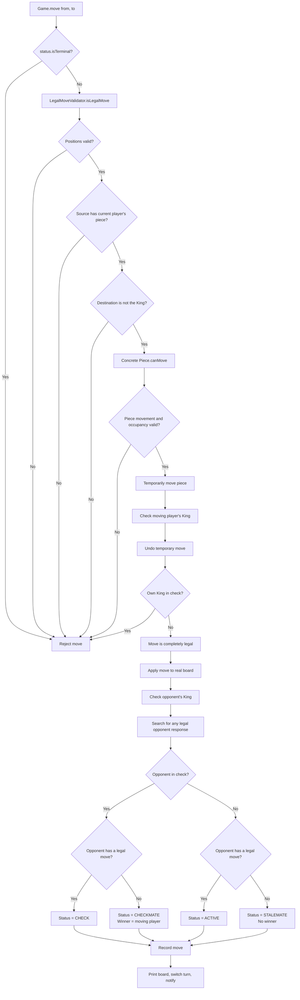

# Chess LLD Quick Revision

## Core design

- `Game` owns match flow: players, current turn, status, winner, move history, validation, capture, and turn switching.
- `Board` owns the location of pieces and provides operations to inspect or update squares.
- `Piece` owns common piece data such as `Color` and defines the polymorphic `canMove(...)` contract.
- Each concrete piece validates only its movement shape and any piece-specific path rules.
- Keep common rules such as turn validation, source ownership, friendly destination, capture, and board mutation in the move pipeline.
- `canMove(...)` should only validate; it should not capture a piece or mutate the board.
- Keep `Position` immutable because a board coordinate is a value object.
- Creating a few temporary `Position` records while checking a path is negligible on an 8x8 board.

## Constructors and inheritance

- `super(color)` calls the `Piece` constructor so the inherited `color` field is initialized.
- A subclass must call `super(color)` because `Piece` has no no-argument constructor.
- A `super(...)` call must be the first statement in a subclass constructor.
- Prefer a `protected Piece(Color color)` constructor because only subclasses should initialize `Piece`.

## Polymorphism

- `Piece` defines the common `canMove(...)` contract, and every concrete piece overrides it with its own movement rules.
- A variable declared as `Piece` can refer to a `Rook`, `Bishop`, `Queen`, or another concrete piece.
- Calling `piece.canMove(...)` invokes the concrete piece's overridden method at runtime.
- Piece polymorphism avoids a large `if` or `switch` that checks the piece type before every move.
- Use polymorphism for fundamentally different piece behavior; do not introduce Strategy unless movement must vary independently from the piece.

## Sliding-piece movement

- `Integer.compare(to, from)` returns `-1`, `0`, or `1`, giving a one-square direction rather than the total distance.
- Do not use raw subtraction as the step because it jumps directly to the destination and skips blocker checks.
- Begin path checking one square after `from` and stop before `to`.
- Reject a sliding move if any intermediate square contains a piece.
- Reject `from.equals(to)` explicitly because remaining on the same square is never a move.
- An empty destination is valid; an opponent destination is a capture; a friendly destination is invalid.

## Rook

- A Rook moves straight when the source and destination share a row or share a column.
- Rook validation does not need row and column distances; it only needs `movesStraight` and path direction.
- Horizontal movement has `rowStep = 0`; vertical movement has `columnStep = 0`.

## Bishop

- A Bishop moves diagonally when `abs(row change) == abs(column change)`.
- A Bishop needs row and column differences to verify the diagonal movement shape.
- Both Bishop steps are always either `-1` or `1` after same-position movement is rejected.

## Queen

- A Queen combines Rook and Bishop movement: `movesStraight || movesDiagonally`.
- Reject a Queen move only when it is neither straight nor diagonal.
- Rook, Bishop, and Queen share the same path-obstruction algorithm; extract it only after the duplication becomes clear.

## Complete Move Flow



### Stage 1: Piece-level validation

- `GameStatus.isTerminal()` rejects moves after checkmate, stalemate, or draw.
- `Piece.canMove(...)` validates only the concrete piece's movement, path, and destination occupancy.
- This is a **pseudo-legal move** because the movement may still expose the moving player's King.
- Polymorphism selects `Rook.canMove(...)`, `Pawn.canMove(...)`, or another concrete implementation at runtime.

### Stage 2: Complete legal-move validation

- `LegalMoveValidator` temporarily applies the pseudo-legal move.
- `CheckDetector` examines the resulting position for an attack on the moving player's King.
- `Board.undoMove(...)` always restores the source and destination after this simulation.
- If the moving player's King is attacked, reject the request without changing history, status, board, or turn.
- If the King is safe, the request is a complete legal move and `Game` may apply it permanently.

```text
Before simulation:
from -> moving piece
to   -> captured piece or empty

During simulation:
from -> empty
to   -> moving piece

After undo:
from -> moving piece
to   -> original captured piece or empty
```

### Stage 3: Opponent-state evaluation

- After permanently applying the move, check whether the opponent's King is attacked.
- `hasAnyLegalMove(...)` searches every opponent piece and destination but stops after finding one legal response.
- The search uses `isLegalMove(...)`, so pinned pieces and moves that leave the King attacked are rejected.
- A response may move the King, capture the attacker, or block the attack.

| Opponent in check? | Has a legal move? | Result |
|---|---|---|
| No | Yes | `ACTIVE` |
| Yes | Yes | `CHECK` |
| Yes | No | `CHECKMATE`; moving player wins |
| No | No | `STALEMATE`; game is drawn |

### Stage 4: Commit accepted move

- Add the accepted `Move` to history only after complete legal validation.
- Print the updated board only for an accepted move.
- Switch the turn only after an accepted move.
- Notify the opponent for `CHECK`, announce the winner for `CHECKMATE`, or announce a draw for `STALEMATE`.
- A rejected move never consumes the player's turn.

### Key distinction

```text
Piece.canMove(...)
    = Can this type of piece geometrically reach the destination?

LegalMoveValidator.isLegalMove(...)
    = Can the player make this move without leaving their King in check?

Game.move(...)
    = Apply an accepted move and update history, turn, status, and winner.
```

## Board Coordinates and Direction

- The board uses zero-based `Position(row, column)` coordinates from `0` through `7`.
- Black's back rank is row `0`, and Black's Pawns start on row `1`.
- White's Pawns start on row `6`, and White's back rank is row `7`.
- White moves toward decreasing rows, so its Pawn direction is `-1`.
- Black moves toward increasing rows, so its Pawn direction is `1`.
- Columns `0` through `7` correspond to files `a` through `h`.

```text
Chess rank:     8  7  6  5  4  3  2  1
Array row:      0  1  2  3  4  5  6  7

Chess file:     a  b  c  d  e  f  g  h
Array column:   0  1  2  3  4  5  6  7
```

## Remaining Piece Rules

### Knight

- A Knight moves when the absolute row and column differences are `(2, 1)` or `(1, 2)`.
- "Not straight and not diagonal" alone is insufficient because many arbitrary moves satisfy that description.
- A Knight does not inspect intermediate squares because it can jump over pieces.

### King

- A King moves exactly one square horizontally, vertically, or diagonally.
- `LegalMoveValidator` rejects a King move onto an attacked square by simulating it and checking King safety.
- The two Kings cannot become adjacent because each King attacks every neighboring square.
- A King is never captured; checkmate ends the game before capture.

### Pawn

- A Pawn moves one square forward only when the destination is empty.
- A Pawn moves two squares only from its starting row and only when the intermediate and destination squares are empty.
- A Pawn captures one square diagonally forward and cannot capture by moving straight.
- Keep the signed row difference because using `abs` would make forward and backward movement indistinguishable.
- Use the absolute column difference because diagonal capture may go left or right.

## Check, Checkmate, and Stalemate

- A move that follows piece geometry but exposes its own King is pseudo-legal but not legally playable.
- A pinned piece cannot move in a way that exposes its King.
- A player in check must move the King, capture the attacker, or block the attack.
- Checking only the King's neighboring squares is insufficient because another piece may resolve check.

```text
CHECK
    = King is attacked
      AND at least one legal response exists

CHECKMATE
    = King is attacked
      AND no legal response exists

STALEMATE
    = King is not attacked
      AND no legal move exists
```

## Responsibility Map

| Component | Responsibility |
|---|---|
| `Position` | Immutable row and column value |
| `Piece` | Common color state and polymorphic movement contract |
| Concrete pieces | Piece-specific geometry, paths, and occupancy rules |
| `Board` | Piece placement, movement, rollback, and display |
| `CheckDetector` | Find a King and determine whether an opponent attacks it |
| `LegalMoveValidator` | Validate ownership, simulate moves, protect the King, and search for a legal response |
| `Game` | Apply accepted moves and manage history, turn, status, winner, and notifications |
| Driver | Construct and inject dependencies, create the game, and run the demonstration |

## Constructor Injection

- The Driver is the composition root; it creates dependencies and wires the object graph.
- Constructor injection makes dependencies explicit without requiring Spring or another framework.
- Concrete classes are sufficient until multiple implementations create a genuine need for interfaces.
- `Game` and `LegalMoveValidator` should not construct their own `CheckDetector`.

```text
Driver
  -> creates CheckDetector
  -> injects CheckDetector into LegalMoveValidator
  -> injects CheckDetector and LegalMoveValidator into Game
```

## Common Mistakes

- Keep board-boundary and same-position validation in `LegalMoveValidator` because it runs before board access.
- Use `destination == null || destination.color != moving.color`; using `&&` dereferences `null` and rejects occupied destinations.
- Use `Integer.compare(to, from)` for a `-1`, `0`, or `1` path direction; raw subtraction skips intermediate squares.
- Reject a sliding move when any intermediate square is occupied.
- Do not mutate the board inside `Piece.canMove(...)`.
- Always undo a simulated move before returning from legal-move validation.
- Do not add rejected moves to history, print them, change status, or switch turns.
- Do not allow direct King capture.
- Do not use `winner != null` as the terminal check because stalemate and draw have no winner.
- Use `GameStatus.isTerminal()` for checkmate, stalemate, and draw.
- Use `||` when any invalid condition should reject a move; use `&&` only when all conditions must hold together.

## Complexity

- Board lookup and mutation are `O(1)` because the board is a fixed two-dimensional array.
- Sliding-piece validation inspects at most six intermediate squares on an 8x8 board.
- `CheckDetector` scans at most 64 board squares.
- `hasAnyLegalMove(...)` tries at most 16 pieces against 64 destinations and stops after its first legal result.
- The straightforward search is easily fast enough for an interview-sized 8x8 Chess engine.
- Avoid complex pin maps, attack caches, or search optimizations until scale or AI requirements justify them.

## Fool's Mate Demonstration

- Fool's Mate is the fastest standard checkmate and provides a deterministic Driver demonstration.

```text
1. White f2 -> f3       Position(6,5) -> Position(5,5)
1... Black e7 -> e5     Position(1,4) -> Position(3,4)
2. White g2 -> g4       Position(6,6) -> Position(4,6)
2... Black Qd8 -> h4#   Position(0,3) -> Position(4,7)
```

- The Black Queen attacks the White King along `h4 -> g3 -> f2 -> e1`.
- White cannot move the King, capture the Queen, or block the attack, so the game enters `CHECKMATE`.
- `#` in chess notation means checkmate.

## Explicitly Deferred Scope

- Castling and tracking whether the King or Rook has moved.
- En passant and its dependency on recent move history.
- **Pawn promotion:** Extend the move request with a choice of Queen, Rook, Bishop, or Knight.
- After a Pawn legally reaches its final row, replace it through a small piece factory before evaluating check or checkmate.
- Record the promotion choice in move history so the move remains auditable and undoable.
- Threefold repetition, the fifty-move rule, and insufficient-material draw.
- Resignation, draw agreement, undo/redo, and algebraic notation.
- Chess clocks, persistence, networking, concurrency, and computer-controlled players.

## Interview guidance

- Prefer intention-revealing names such as `movesStraight`, `movesDiagonally`, `rowStep`, and `columnStep`.
- Implement normal movement and captures first; discuss castling, en passant, promotion, check, and checkmate as scoped extensions.
- A smaller correct design with clear responsibilities is stronger than many patterns and incomplete chess behavior.
